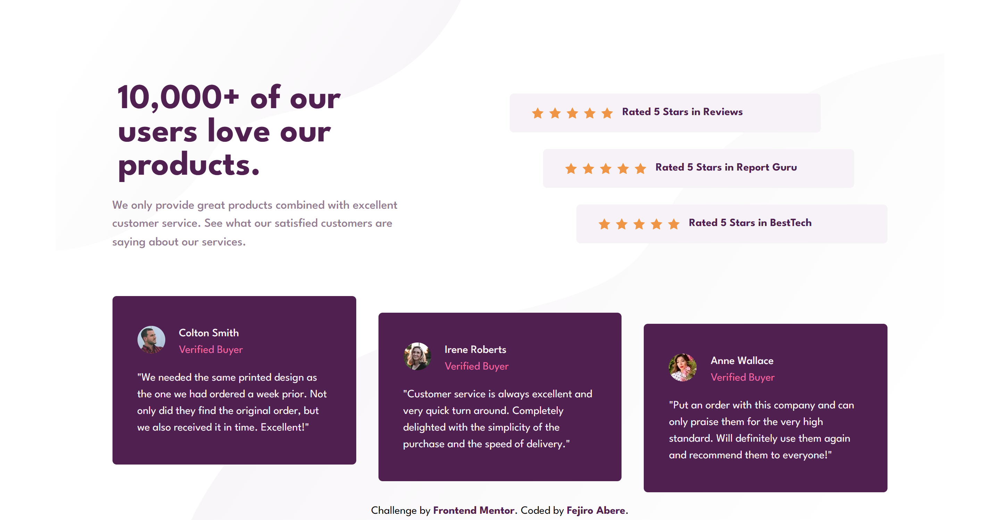

# Frontend Mentor - Social proof section solution

This is a solution to the [Social proof section challenge on Frontend Mentor](https://www.frontendmentor.io/challenges/social-proof-section-6e0qTv_bA). Frontend Mentor challenges help you improve your coding skills by building realistic projects. 

## Table of contents

- [Overview](#overview)
  - [The challenge](#the-challenge)
  - [Screenshot](#screenshot)
  - [Links](#links)
- [My process](#my-process)
  - [Built with](#built-with)
  - [Useful resources](#useful-resources)
- [Author](#author)

## Overview

### The challenge

Users should be able to:

- View the optimal layout for the section depending on their device's screen size

### Screenshot

### Links

- Solution URL: [Solution]()
- Live Site URL: [Live Site](https://fejiro001.github.io/social-proof-section-master/)

## My process

### Built with

- Semantic HTML5 markup
- Flexbox
- CSS Grid
- Mobile-first workflow
- TailwindCSS - For styles

### Useful resources

- [Working with Multiple Images in Tailwind CSS](https://devjhex.medium.com/working-with-multiple-images-in-tailwind-css-7def910cecd1) - Helped me in placement of 2 background images using tailwindcss.

## Author

- Frontend Mentor - [@Fejiro001](https://www.frontendmentor.io/profile/Fejiro001)
- Twitter - [@aberefejiro](https://www.twitter.com/aberefejiro)
